# ADR-001: Nachrichtenpriorität, Slot-Negotiation und Logging-Verbesserungen

**Status:** Phase 1 implementiert (v4.35n_prio_v20260315)

**Datum:** 2026-03-15

**Autoren:** Martin DK5EN

**Kontext:** MeshCom Firmware v4.35+

### Implementierungsstatus

| Vorschlag | Status | Version | Anmerkung |
|-----------|--------|---------|-----------|
| **A: Priority-Queue** | Implementiert | v4.35n_prio_v20260315 | 5 Stufen, Prio-Entnahme, Prio-CSMA, Prio-Drop |
| **B: Slot-Negotiation** | Offen | — | Abhaengig von Feldtest-Ergebnissen Phase 2 |
| **C: Trickle-HEY** | Implementiert | v4.35n_prio_v20260315 | RFC 6206 adaptiert, ESP32 + nRF52 |
| **D: Logging & HWM** | Implementiert | v4.35n_prio_v20260315 | [MC-STAT], [MC-PRIO], [MC-HWM], [MC-TRICKLE] |

---

## 1. Zusammenfassung

Dieses ADR beschreibt vier zusammenhängende Verbesserungsvorschläge für die MeshCom-Firmware:

1. **Nachrichtenpriorität** — Lokale Priorisierung der TX-Queue + differenzierter CSMA-Backoff
2. **Slot-Negotiation als Fast-Lane** — Hybrid TDMA/CSMA: Slot-Info in **jedem** Paket, nicht nur HEY
3. **Adaptive HEY-Frequenz** — Trickle-Algorithmus zur Reduktion von Beacon-Overhead
4. **Logging & High-Water-Marks** — Erweiterung von `serial_monitor.py` und `loganalyse.sh`

**Leitprinzip: Mischbetrieb über Jahre.** Neue Firmware ist schneller, alte Firmware funktioniert weiter. Kein Node wird ausgesperrt. Wer updatet, profitiert sofort — und motiviert dadurch andere zum Update.

---

## 2. Problemstellung

### 2.1 Ist-Zustand (aus Loganalysen vom 13.-14. März 2026)

Die Alpine-Gateway-Analyse von 5 Bergstationen über 60+ Stunden zeigt:

| Metrik | Wert | Bewertung |
|--------|------|-----------|
| Direkt gehörte Nodes (H00) | 85-124 | Sehr dicht |
| CAD-Busy-Rate (Berg) | 50-80% | Nahe Sättigung |
| Duplikat-/Relay-Anteil | 50-67% | Enormer Overhead |
| CRC-Fehlerrate | 15-53% | Hidden-Node-Problem |
| TX-Queue Auslastung (max) | 12/30 (40%) | Kein Überlauf |
| ACK-Erfolgsrate | 15-97% | Stark standortabhängig |

### 2.2 Kernproblem

```
Die TX-Queue läuft selten über — aber wenn ein Nutzer eine DM sendet,
steht diese hinter 5-10 Relay/HEY-Paketen in der FIFO-Warteschlange.
Jedes Paket wartet 2-5 Sekunden auf CSMA-Freigabe.
Ergebnis: 10-50 Sekunden unnötige Verzögerung für menschliche Nachrichten.
```

### 2.3 Code vor Phase 1 (alter Ist-Zustand)

- **Ein einziger Ring-Buffer** (`ringBuffer[MAX_RING]`) mit FIFO-Verarbeitung
- **Kein Prioritätskonzept** — alle Nachrichtentypen werden gleich behandelt
- **Retry nur für persönliche DMs** (Text 0x3A mit Callsign-Ziel, max 3x über 120s)
- **Gruppen und Broadcast "*" sind fire-and-forget** — kein ACK, kein Retry
- **CSMA-Backoff** identisch für alle Nachrichtentypen (4500ms/3000ms/2000ms)
- **HEY-Frames** tragen nur Nachbarzahl (`;NCOUNT;`), keine Slot-Info

### 2.3a Code nach Phase 1 (implementiert in v4.35n_prio_v20260315)

- **Gleicher Ring-Buffer** + paralleles `ringPriority[MAX_RING]` Array (30 Bytes RAM)
- **5 Prioritätsstufen** — ACK/DM (Prio 1) bis HEY (Prio 5)
- **Prio-Erkennung** via `getMessagePriority()`: msg_type, RING_STATUS_DONE (Relay), CheckGroup(dest)
- **Prio-Entnahme** via `getNextTxSlot()`: scannt Ring-Buffer, waehlt hoechste Prio (FIFO bei gleicher Prio)
- **Prio-CSMA-Backoff**: 3000ms (ACK/DM/Gruppe) bis 5500ms (POS/HEY), statt einheitlich 4500ms
- **Prio-Drop**: bei voller Queue wird niedrigste Prio verworfen; neues Paket nur eingefuegt wenn hoehere Prio
- **Trickle-HEY**: adaptives Intervall 30s–15min (RFC 6206), Suppression bei >=2 konsistenten Nachbar-HEYs
- **Latenz-Tracking**: `ringEnqueueTime[MAX_RING]`, Statistik pro Prio alle 5 Min
- **Kein On-Air-Change** — alte Firmware empfaengt alle Pakete korrekt

### 2.4 Nachrichtentypen im Code (aus Analyse)

| Typ | Code | Ziel | ACK/Retry | Beispiel |
|-----|------|------|-----------|----------|
| Persönliche DM | 0x3A | Callsign (z.B. `OE1ABC`) | Ja (3x/120s) | `OE1KBC>OE1ABC:Hallo{123` |
| Gruppen-Nachricht | 0x3A | Nummer (z.B. `20`) | Nein | `OE1KBC>20:Info` |
| Broadcast "*" | 0x3A | `*` | Nein | `OE1KBC>*:CQ` |
| Position | 0x21 | — | Nein | GPS-Beacon |
| HEY | 0x40 | — | Nein | Neighbour-Discovery |
| ACK | 0x41 | — | Nein | Empfangsbestätigung |

**Entscheidende Erkenntnis:** Alle Texttypen (DM, Gruppe, Broadcast) nutzen denselben MSG_TYPE 0x3A. Die Unterscheidung erfolgt über das Zielfeld (`CheckGroup()` und `bDM`-Flag in `loop_functions.cpp:2309`).

---

## 3. Nachrichtentypen und Prioritätsklassen

### 3.1 Prioritätsmatrix

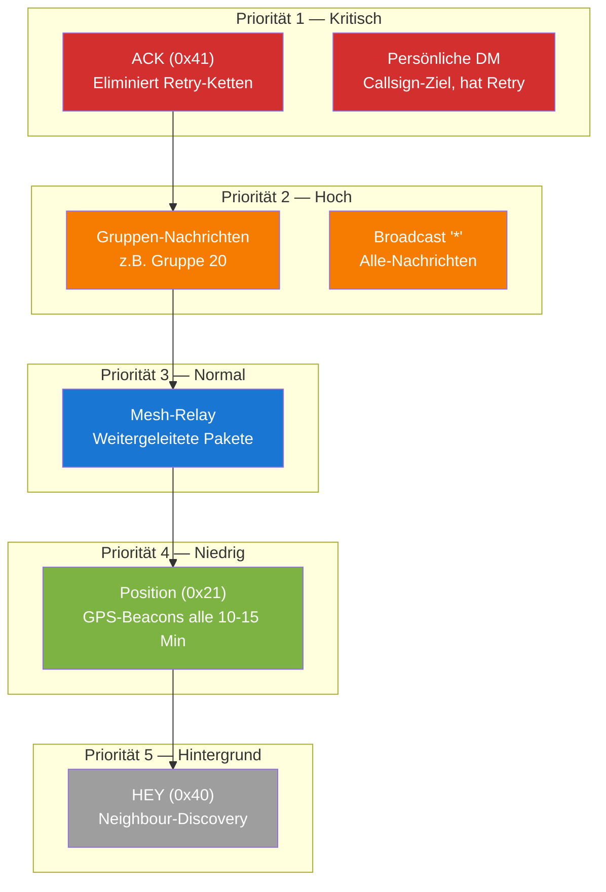

### 3.2 Begründung der Reihenfolge

| Prio | Typ | Begründung |
|------|-----|-------------|
| 1 | ACK | Ein verlorener ACK erzeugt bis zu 3 Retransmits = 3x mehr Airtime. ACK-Prio spart Kanal. |
| 1 | Persönliche DM | Menschlich erzeugt, zeitkritisch, höchster Informationswert. Hat Retry-Mechanismus. |
| 2 | Gruppen + Broadcast "*" | Zweithäufigste Nutzerinteraktion. Fire-and-forget, daher wichtig dass sie beim ersten Mal ankommen. |
| 3 | Mesh-Relay | Wichtig für Netzabdeckung, aber ein verpasstes Relay wird oft von anderem Node übernommen. |
| 4 | Position | Periodisch (10-15 Min), nächstes Update kommt automatisch. |
| 5 | HEY | Höchste Frequenz, niedrigster Informationswert pro Paket. |

### 3.3 Prio-Erkennung im Code

```
Pseudo-Code für Prio-Zuweisung:

function getPriority(ringSlot):
    type = ringBuffer[slot][2]

    if type == MSG_TYPE_ACK:        return PRIO_1
    if type == MSG_TYPE_POSITION:   return PRIO_4
    if type == MSG_TYPE_HEY:        return PRIO_5

    if type == MSG_TYPE_TEXT:
        if isRelay(slot):           return PRIO_3
        dest = parseDestination(slot)
        if CheckGroup(dest) != 0:   return PRIO_2   // Gruppe
        if dest == "*":             return PRIO_2   // Broadcast
        return PRIO_1                                // Persönliche DM
```

---

## 4. Vorschlag A: Lokale Priority-Queue

### 4.1 Architektur

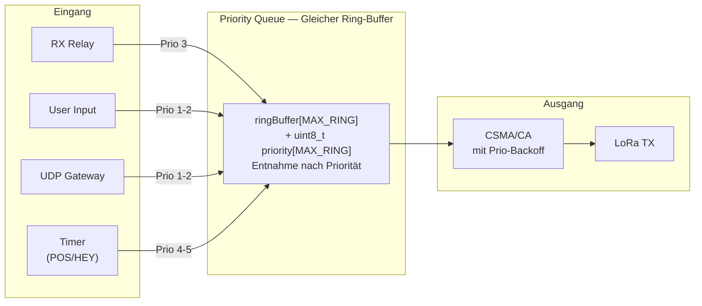

### 4.2 Implementierungsdetails

**Minimale Änderung am bestehenden Ring-Buffer:**

Der bestehende `ringBuffer[MAX_RING]` bleibt unverändert. Neu kommt ein paralleles Array:

```c
uint8_t ringPriority[MAX_RING];   // Prio 1-5 pro Slot
```

Die Entnahme-Logik in `getNextTxPacket()` ändert sich von FIFO (`iRead++`) zu:

```
Pseudo-Code:

function getNextTxPacket():
    best_slot = -1
    best_prio = 255

    for slot = 0 to MAX_RING-1:
        if ringBuffer[slot][1] == RING_STATUS_READY:
            if ringPriority[slot] < best_prio:
                best_prio = ringPriority[slot]
                best_slot = slot
            elif ringPriority[slot] == best_prio:
                // Bei gleicher Prio: ältester Eintrag (FIFO innerhalb Prio)
                best_slot = älterer(best_slot, slot)

    return best_slot   // -1 wenn nichts zu senden
```

**RAM-Aufwand:** 30 Bytes (ein `uint8_t` pro Slot). Kein zusätzlicher Buffer nötig.

### 4.3 Differenzierter CSMA-Backoff

Höhere Priorität = kürzerer Backoff = schnellerer Kanalzugriff:

| Prio | Base-Timeout | Slot-Range | Effektive Wartezeit |
|------|-------------|------------|---------------------|
| 1 (ACK/DM) | 3000 ms | 0-10 Slots (350ms) | 3.0 - 3.35s |
| 2 (Gruppe/*) | 3000 ms | 0-10 Slots (350ms) | 3.0 - 3.35s |
| 3 (Relay) | 4500 ms | 0-10 Slots (350ms) | 4.5 - 4.85s |
| 4 (POS) | 5500 ms | 0-10 Slots (350ms) | 5.5 - 5.85s |
| 5 (HEY) | 5500 ms | 0-10 Slots (350ms) | 5.5 - 5.85s |

### 4.4 Koexistenz mit alter Firmware

**Verhalten der alten Firmware (Master-Branch):**

Die alte Firmware hat **kein CAD** (Channel Activity Detection). Ihr TX-Mechanismus ist ein einfacher Timer:

1. Nach jedem empfangenen Paket: `iReceiveTimeOutTime = millis()`
2. Warte `RECEIVE_TIMEOUT` (4500ms) ohne neues Paket
3. Nach 4.5s: `iReceiveTimeOutTime = 0` → TX-Gate öffnet sich
4. **Blind senden** — kein CAD-Scan, keine Prüfung ob Kanal frei ist
5. **Harter Abbruch:** Wenn während des 4.5s-Timers ein Paket empfangen wird, wird der Timer zurückgesetzt. Aber wenn der Timer abläuft und gerade ein fremdes Paket auf dem Kanal liegt, wird der laufende Empfang abgebrochen (`radio.startReceive()` resettet den Receiver).

```
// Master-Branch TX-Gate (esp32_main.cpp:1757):
if(iReceiveTimeOutTime == 0 && !bEnableInterruptTransmit)
{
    // "channel is free" ← FALSCH: kein CAD, nur Timer = 0
    if (iWrite != iRead)
    {
        doTX();  // Blind senden!
    }
}
```

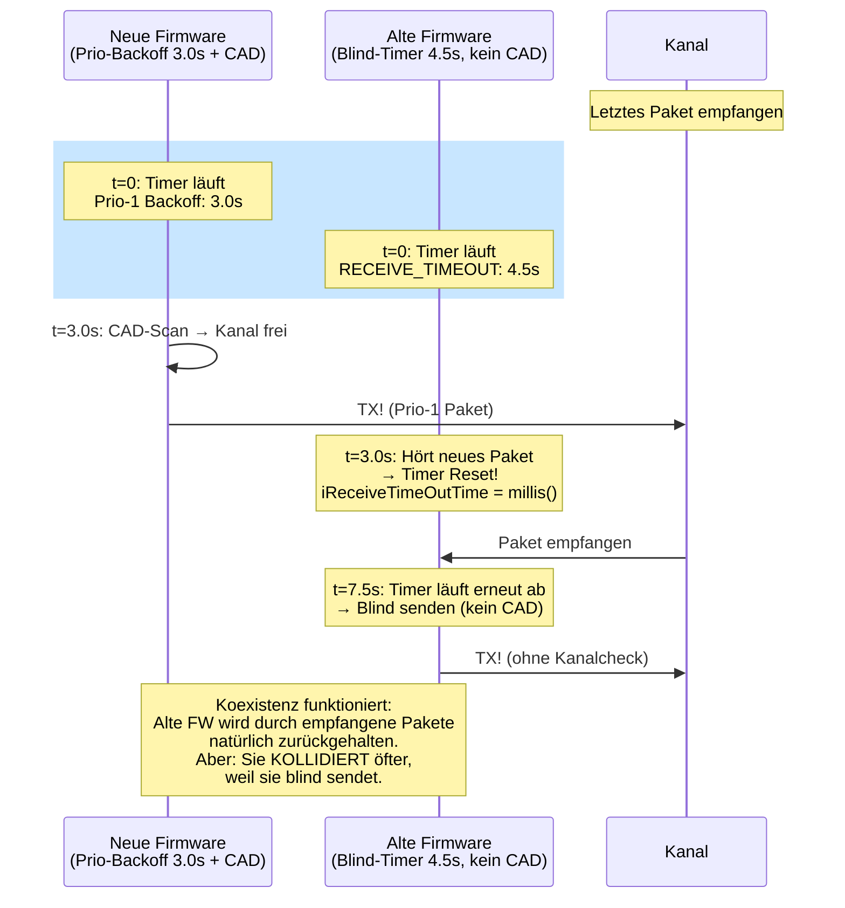

**Koexistenz-Analyse:**

| Szenario | Verhalten | Risiko |
|----------|-----------|--------|
| Neue FW sendet während alte wartet | Alte FW hört Paket → Timer-Reset → wartet nochmal 4.5s | Kein Problem |
| Alte FW Timer läuft ab, Kanal belegt | Alte FW sendet blind → **Kollision!** | Wie bisher — alte FW kollidiert heute schon |
| Beide Timer laufen gleichzeitig ab | Neue FW sendet nach 3.0s, alte nach 4.5s → zeitversetzt | Neue FW ist 1.5s früher dran |
| Kanal leer, beide wollen senden | Neue FW gewinnt immer (kürzerer Timeout) | Korrekt — Update-Anreiz |

**Wichtig:** Die alte Firmware wird **nicht schlechter** als heute. Sie kollidiert heute schon blind — das ändert sich nicht. Die neue Firmware ist einfach **schneller und sicherer dran** dank CAD + kurzerem Prio-Backoff. Das ist ein natürlicher Anreiz zum Update, ohne alte Nodes auszusperren.

### 4.5 Drop-Strategie bei voller Queue

**Regel:** Wenn die Queue voll ist, wird der älteste Eintrag der **niedrigsten belegten Priorität** verworfen.

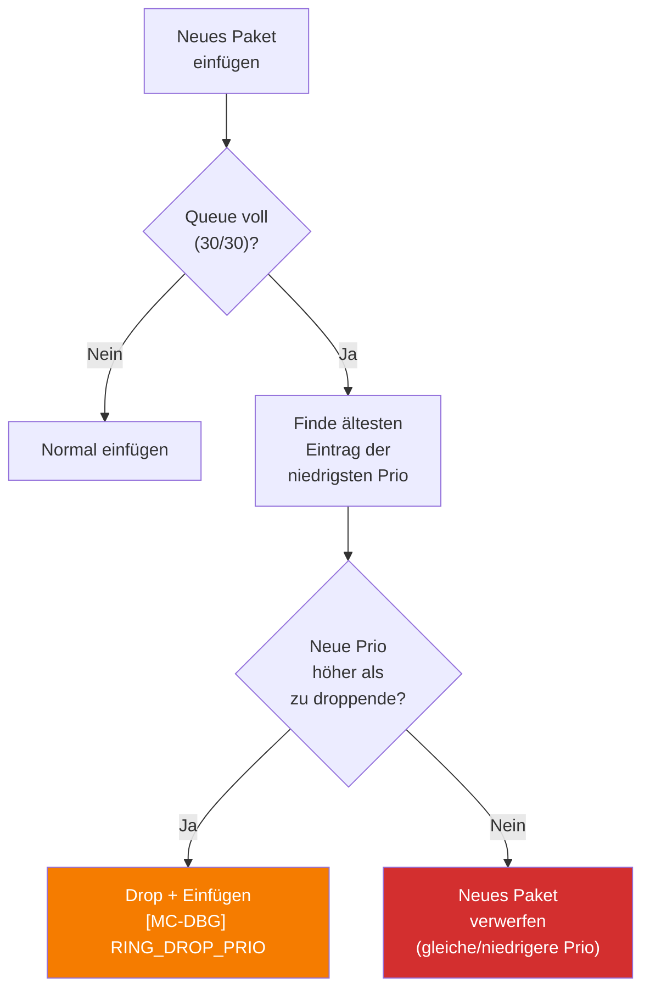

Ein HEY wird vor einem POS gedroppt, ein POS vor einem Relay. ACKs und DMs werden **nie** zugunsten niedrigerer Pakete verworfen.

---

## 5. Vorschlag B: Slot-Negotiation als Fast-Lane (Hybrid TDMA/CSMA)

### 5.1 Grundidee

Nicht alle Nodes brauchen einen Slot — aber wer einen hat, darf **ohne CSMA-Wartezeit** senden. Das ist die "Fast-Lane". Alle anderen nutzen weiterhin CSMA.

### 5.2 Slot-Info in JEDEM Paket (nicht nur HEY)

**Jedes ausgehende Paket trägt Slot-Info** als Micro-Header.

**Problem mit HEY:** HEY kommt nur alle 15 Minuten. Slot-Konvergenz über HEY allein dauert 30+ Minuten.

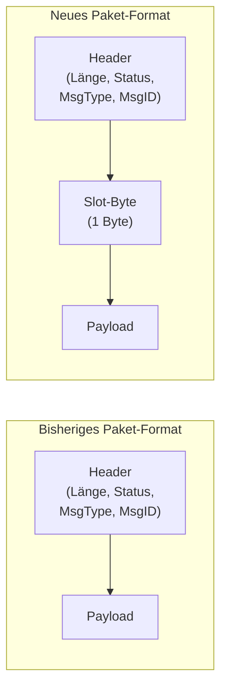

**Slot-Byte Aufbau (1 Byte):**

```
Bit 7:    Slot-Feature aktiv (1) oder nicht (0)
Bit 6-4:  Eigener Slot-Nummer (0-15, 0x7=kein Slot)
Bit 3-0:  Superframe-Phase (0-15, aktueller Zeitpunkt im Superframe)
```

**Warum nur 1 Byte statt Bitmap?**
- Jeder Node advertiert nur seinen EIGENEN Slot
- Die Bitmap wird lokal aus den empfangenen Slots aller Nachbarn aufgebaut
- Spart 2 Bytes pro Paket (bei 100+ Nodes und jedem Paket relevant)

### 5.3 Koexistenz: Slot-Byte und alte Firmware

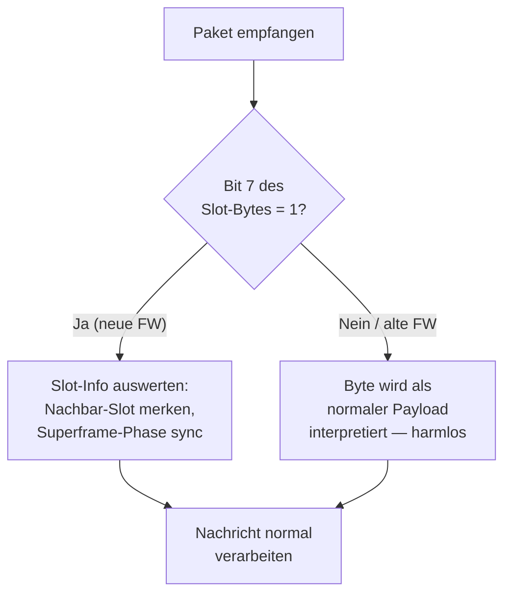

**Alte Firmware:** Sieht das Slot-Byte als Teil des Payloads. Da es vor dem eigentlichen APRS-Content steht und kein gültiges APRS-Zeichen ist (Bit 7 gesetzt = Wert >= 0x80), wird es als Müll ignoriert oder übersprungen. **Kein Crash, keine Fehlfunktion.**

**Neue Firmware sendet an alte Firmware:** Das Paket kommt an. Das Slot-Byte wird von alter Firmware ignoriert. Die Nachricht wird normal angezeigt.

**Alte Firmware sendet an neue Firmware:** Kein Slot-Byte vorhanden (Bit 7 = 0 im ersten Payload-Byte). Neue Firmware erkennt: "Kein Slot-Feature" und verarbeitet normal.

### 5.4 Was ist ein Superframe — und warum brauchen wir einen?

#### Das Problem ohne Zeitstruktur

Wenn Node A Slot 3 beansprucht und Node B Slot 7 — woher wissen beide, *wann* Slot 3 bzw. Slot 7 dran ist? Ohne gemeinsames Zeitraster sind Slot-Nummern bedeutungslos. Es braucht einen wiederkehrenden Zeitrahmen, in dem jeder Slot einen festen Platz hat. Diesen Rahmen nennt man **Superframe**.

#### Was ein Superframe NICHT ist

- **Keine Sendepause.** Kein Node wird am Senden gehindert.
- **Keine Änderung für alte Firmware.** Alte Nodes senden weiter wie bisher — sie wissen nichts vom Superframe.
- **Kein harter TDMA-Takt.** Der Superframe ist ein **Koordinationsangebot**, keine Pflicht.

#### Was ein Superframe IST

Ein Superframe ist eine **gedachte Zeiteinteilung**, die nur in den Köpfen der neuen Firmware existiert. Er teilt die laufende Zeit in wiederkehrende Abschnitte. Für alte Firmware ändert sich **gar nichts** — sie sendet weiterhin nach ihrem 4.5s-Blind-Timer, ohne etwas vom Superframe zu wissen.

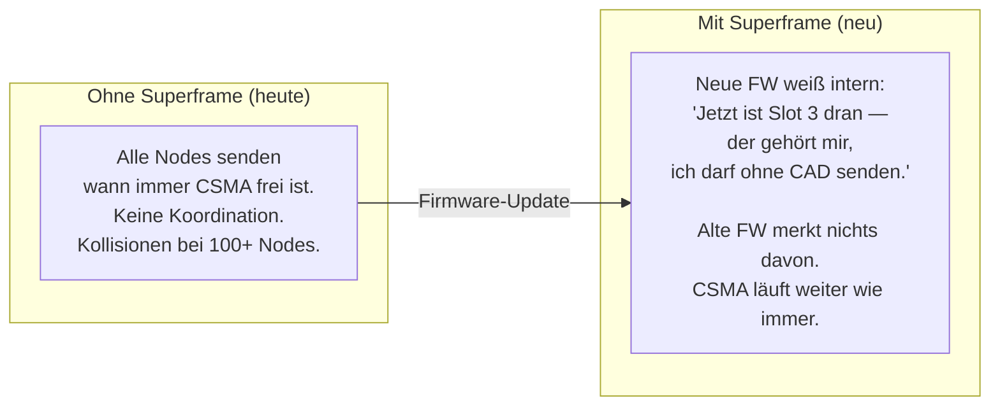

#### Herleitung der Zeitstruktur

Die Slot-Dauer ergibt sich direkt aus der Physik:

1. **LoRa-Paket-Airtime:** ca. 1.2–1.5 Sekunden bei MeshCom-Parametern (EU8: SF11, BW250, CR4/6)
2. **Guardtime für Uhrendrift:** ESP32-Quarze driften ~20ppm = 1.2ms/Minute. Bei 200ms Guardtime kann ein Node >2 Stunden ohne Re-Sync arbeiten.
3. **Reserve:** 300ms für Verarbeitungszeit und TX-Umschaltung
4. **Ergebnis: 2 Sekunden pro Slot** (1.5s Airtime + 200ms Guard + 300ms Reserve)

Bei 16 Slots ergibt sich eine Slot-Phase von 32 Sekunden. Die restliche Zeit ist **offene CSMA-Phase** — genau wie heute, für alle Nodes, ohne Einschränkung.

```mermaid
gantt
    title Superframe (60 Sekunden) — wiederholt sich endlos
    dateFormat X
    axisFormat %s

    section Slot-Phase (32s) — Fast-Lane für Slot-Inhaber
    Slot 0 :s0, 0, 2
    Slot 1 :s1, 2, 4
    Slot 2 :s2, 4, 6
    Slot 3 :s3, 6, 8
    Slot 4 :s4, 8, 10
    Slot 5 :s5, 10, 12
    Slot 6 :s6, 12, 14
    Slot 7 :s7, 14, 16
    Slot 8 :s8, 16, 18
    Slot 9 :s9, 18, 20
    Slot 10 :s10, 20, 22
    Slot 11 :s11, 22, 24
    Slot 12 :s12, 24, 26
    Slot 13 :s13, 26, 28
    Slot 14 :s14, 28, 30
    Slot 15 :s15, 30, 32

    section CSMA-Phase (28s) — offen für alle, wie heute
    Freier CSMA-Zugriff für alle :csma, 32, 60
```

#### Wer darf wann senden?

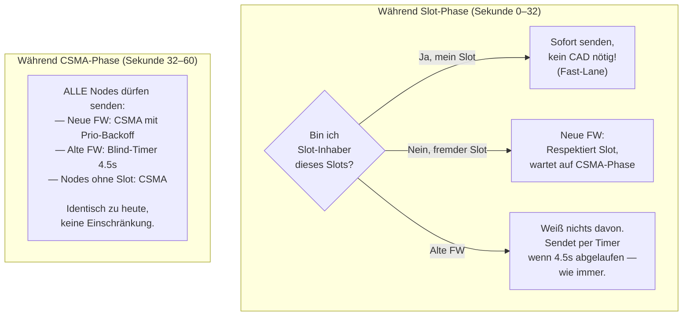

#### Warum verhungert niemand?

| Bedenken | Antwort |
|----------|---------|
| "Alte Firmware kann 32s lang nicht senden!" | **Falsch.** Alte FW kennt den Superframe nicht. Sie sendet wann immer ihr 4.5s-Timer abläuft — auch mitten in der Slot-Phase. Im schlimmsten Fall kollidiert sie mit einem Slot-Inhaber. Das ist **nicht schlimmer als heute**, wo sie ohnehin blind sendet und regelmäßig kollidiert. |
| "Neue FW ohne Slot darf 32s lang nicht senden!" | **Falsch.** Sie darf per CSMA senden, auch während der Slot-Phase. Sie **respektiert nur den gerade aktiven 2s-Slot** eines Nachbarn und wartet maximal diese 2s ab. Die restlichen 30s der Slot-Phase sind frei. |
| "28s CSMA-Phase ist weniger als 60s — also schlechter?" | **Nein.** Heute gibt es gar keine Koordination — 60 Sekunden unkontrollierter Wettbewerb mit 100+ Nodes. Im neuen System: 32s wo nur wenige Nodes geordnet senden + 28s offener CSMA = **insgesamt weniger Kollisionen**, nicht mehr. |
| "Ein Node hat Slot, sendet aber nichts?" | Slot bleibt leer. Keine Airtime-Verschwendung. Der Slot ist ein **Recht**, keine Pflicht. |
| "Was wenn mein Slot genau dann kommt, wenn ich nichts habe?" | Kein Problem — nächste Chance in 60 Sekunden. Und in der CSMA-Phase (28s) darf der Node jederzeit senden. Der Slot ist ein *Bonus*, nicht der einzige Sendezeitpunkt. |

#### Parameter-Übersicht

| Parameter | Wert | Herleitung |
|-----------|------|------------|
| Superframe-Länge | 60 Sekunden | Kurz genug für Mobilität, lang genug für 16 Slots + CSMA |
| Slot-Dauer | 2 Sekunden | 1.5s LoRa-Airtime + 200ms Guard + 300ms Reserve |
| Slot-Anzahl | 16 | 4 Bits im Slot-Byte, passt zu typischer Nachbarschaftsgröße |
| CSMA-Phase | 28 Sekunden | Offener Zugang für alle — alte FW, neue FW, slotlose Nodes |
| Guardtime pro Slot | 200ms | ESP32-Drift ~20ppm = 72ms/Stunde → >2h ohne Re-Sync |

### 5.5 Slot-Vergabe-Algorithmus

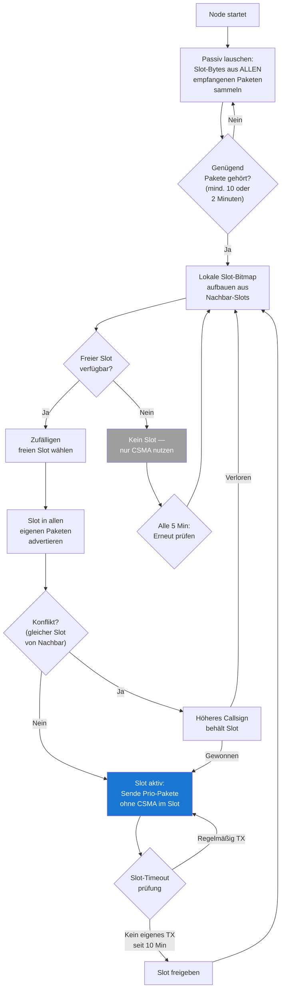

### 5.6 Synchronisation ohne GPS/NTP

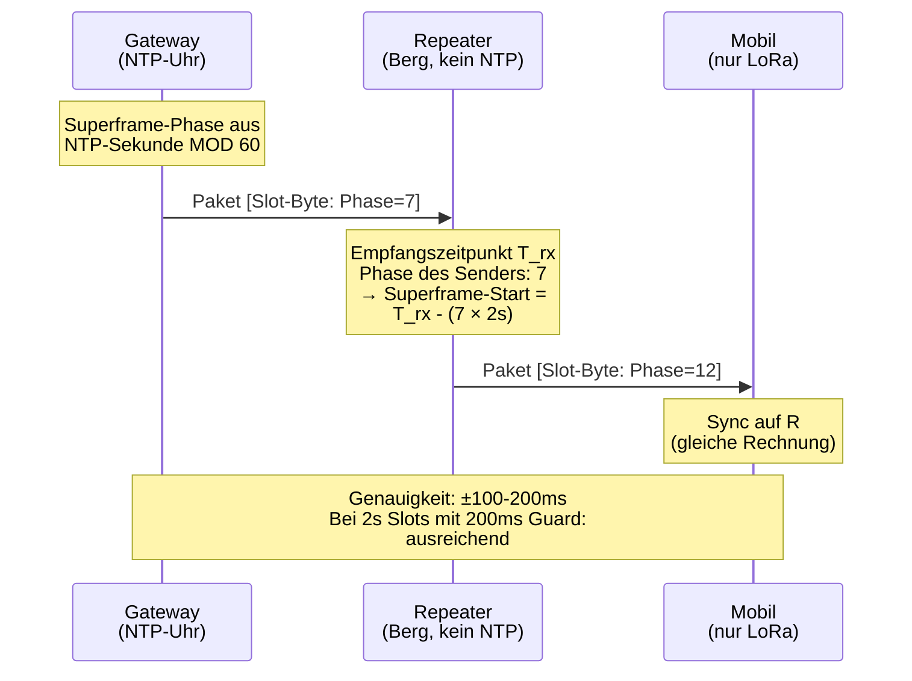

**Sync-Kette:**
1. **Gateways** (mit NTP/GPS) sind Zeitanker. Superframe-Phase = `(millis() / 2000) % 16`
2. **Repeater** synchronisieren auf den zuletzt gehörten Gateway
3. **Mobile Nodes** synchronisieren auf den zuletzt gehörten Repeater/Gateway
4. **Drift-Toleranz:** 200ms Guardtime pro Slot. ESP32-Quarze driften ~20ppm = 1.2ms/Minute = 72ms/Stunde. Selbst ohne Re-Sync bleibt die Drift unter der Guardtime für >2 Stunden.

### 5.7 Was passiert im Slot?

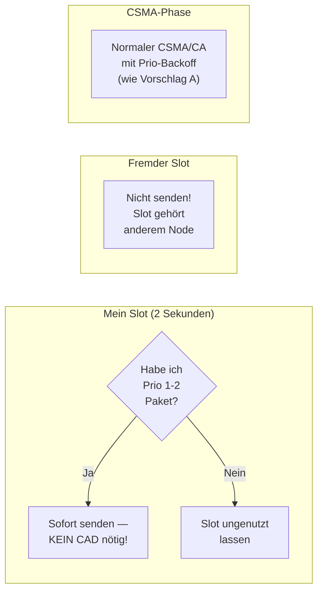

**Nur Prio 1-2 Pakete** (ACK, DM, Gruppen, Broadcast) nutzen den Slot. Prio 3-5 (Relay, POS, HEY) warten auf die CSMA-Phase. Damit ist die Fast-Lane für das reserviert, was den Nutzer interessiert.

### 5.8 Slot-Timeout: 10 Minuten reichen

Da die Slot-Info in **jedem** Paket steckt (nicht nur HEY), werden Nachbarn ständig über belegte Slots informiert. Ein Node, der 10 Minuten lang keinen Slot-Claim gehört hat, darf den Slot als frei betrachten.

| Szenario | Timeout-Verhalten |
|----------|-------------------|
| Node ausgeschaltet | Nachbarn sehen 10 Min kein Paket → Slot frei |
| Node außer Reichweite (mobil) | Gleich wie oben |
| Node sendet selten (Idle) | Eigener HEY alle 15 Min reicht als Keepalive |
| Paket geht verloren | Nächstes Paket (irgendein Typ) erneuert den Claim |

### 5.9 16 Slots für 100+ Nodes?

Nicht jeder Node braucht einen Slot. Die Fast-Lane ist ein **Premium-Feature:**

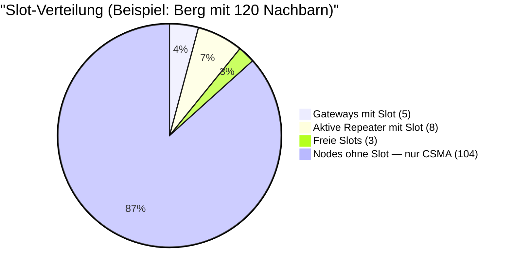

Nodes ohne Slot sind **nicht benachteiligt gegenüber dem Status Quo** — sie nutzen CSMA wie bisher. Die Fast-Lane ist ein Bonus für Nodes, die viel Nutzer-Traffic weiterleiten.

**Selbstregulierung:** Wenn ein Node 10 Minuten lang keinen Prio 1-2 Traffic hat, gibt er seinen Slot frei. Slots wandern automatisch zu den Nodes, die sie brauchen.

---

## 6. Vorschlag C: Adaptive HEY-Frequenz (Trickle-Algorithmus)

### 6.1 Motivation

Bei 100 Nodes mit HEY alle 15 Minuten: ~7 HEY/Minute = ein HEY alle 8.5 Sekunden. Bei 50-80% CAD-Busy ist das signifikanter Overhead für reinen Housekeeping-Traffic.

### 6.2 Trickle-Algorithmus (RFC 6206) für MeshCom

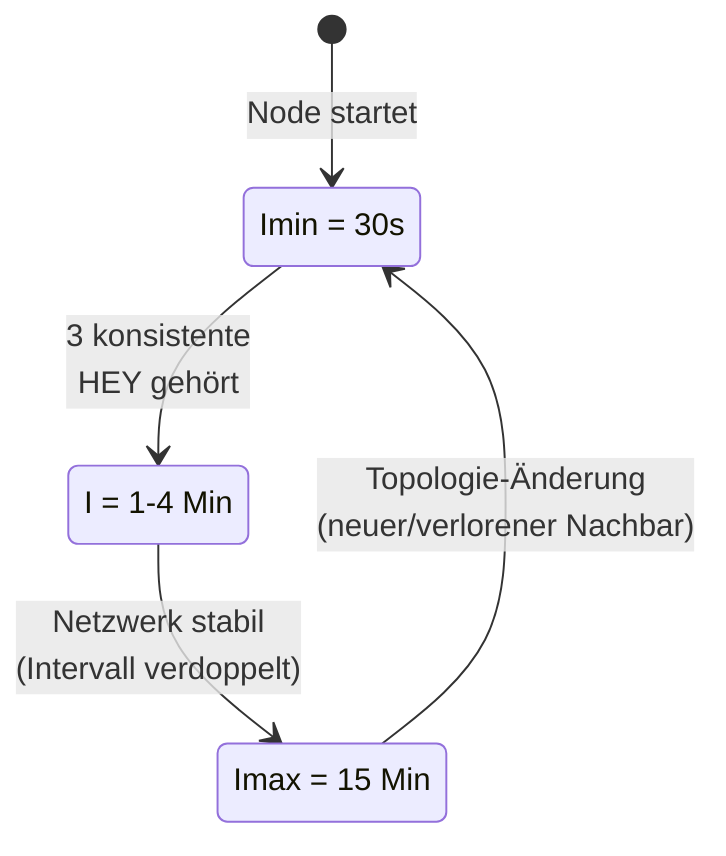

| Parameter | Wert | Bedeutung |
|-----------|------|-----------|
| Imin | 30 Sekunden | Schnellster HEY-Intervall (nach Topologieänderung) |
| Imax | 15 Minuten | Langsamster HEY-Intervall (stabiles Netz, wie bisher) |
| k (Redundanzschwelle) | 2 | Unterdrücke eigenen HEY, wenn >=2 konsistente Nachbar-HEYs gehört |
| Verdopplung | Pro Intervall | 30s -> 1m -> 2m -> 4m -> 8m -> 15m |

**Erwartete Einsparung:** 60-70% weniger HEY-Traffic in stabilen Netzen.

**Wichtig mit Slot-Feature:** Da Slot-Info in jedem Paket steckt, ist ein seltenerer HEY kein Problem für die Slot-Konvergenz. HEY bleibt für die Nachbarerkennung (MHeard) relevant, aber nicht mehr als einziger Slot-Träger.

---

## 7. Vorschlag D: Logging & High-Water-Marks

### 7.1 Bestehende Infrastruktur

MeshCom hat bereits hervorragende Monitoring-Tools:

| Tool | Zweck | Status |
|------|-------|--------|
| `tools/serial_monitor.py` | Echtzeit-Monitoring: State-Machine, Alerts, 300s-Summaries | Vorhanden, gut |
| `tools/loganalyse.sh` | Batch-Analyse: 20+ Sektionen, CRC, CAD, Ring, Dedup, etc. | Vorhanden, sehr umfangreich |

**Was fehlt:** Prioritäts-spezifische Metriken und Slot-Statistiken.

### 7.2 Neue Firmware-Log-Zeilen

**Alle 5 Minuten — Prioritäts-Statistik (immer aktiv):**

```
[MC-STAT] t=300s qmax=8/30 cad_busy=67% cad_ok=33%
  tx: ack=3 dm=2 grp=1 bcast=1 relay=45 pos=12 hey=8
  rx: ok=312 err=89 dup=156
  drop: p5=2 p4=0 p3=0 p2=0 p1=0
  preempt: 3
```

**Alle 5 Minuten — Latenz pro Priorität:**

```
[MC-PRIO] window=300s
  p1_lat_avg=2100ms p1_lat_max=4800ms p1_cnt=5
  p2_lat_avg=3200ms p2_lat_max=5100ms p2_cnt=2
  p3_lat_avg=4800ms p3_lat_max=8400ms p3_cnt=45
  p4_lat_avg=5200ms p4_lat_max=9100ms p4_cnt=12
  p5_lat_avg=5800ms p5_lat_max=11200ms p5_cnt=8
```

**Alle 30 Minuten — High-Water-Marks (kumulativ seit Boot):**

```
[MC-HWM] uptime=3600s
  queue_hwm=12/30 queue_avg=2.3
  csma_hwm_attempts=23 csma_avg=1.4
  onrxdone_hwm_ms=682 onrxdone_avg=87
  relay_burst_hwm=8/10s
  ack_wait_hwm_ms=42000
```

**Bei Slot-Feature — Slot-Statistik:**

```
[MC-SLOT] window=300s
  own_slot=3 phase_drift_ms=45
  neighbors_with_slot=7/16
  slot_tx=4 slot_skip=12 csma_tx=67
  slot_collision=0 slot_timeout=1
```

### 7.3 Erweiterungen für serial_monitor.py

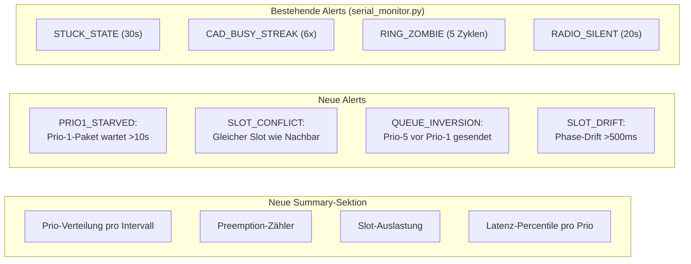

### 7.4 Erweiterungen für loganalyse.sh

Neue Sektionen:

```
=== PRIORITY_DISTRIBUTION ===
  Prio 1 (ACK/DM):   5.2% aller TX (avg 3.1/5min)
  Prio 2 (Grp/Bcast): 2.8% aller TX (avg 1.7/5min)
  Prio 3 (Relay):    68.4% aller TX (avg 41.2/5min)
  Prio 4 (POS):      15.3% aller TX (avg 9.2/5min)
  Prio 5 (HEY):       8.3% aller TX (avg 5.0/5min)

=== PRIORITY_LATENCY ===
  Prio 1: avg=2.1s  p50=1.8s  p95=4.8s  max=7.2s
  Prio 2: avg=3.2s  p50=2.9s  p95=5.1s  max=8.4s
  Prio 3: avg=4.8s  p50=4.5s  p95=8.4s  max=12.1s
  Prio 4: avg=5.2s  p50=5.0s  p95=9.1s  max=14.3s
  Prio 5: avg=5.8s  p50=5.5s  p95=11.2s max=18.7s

=== SLOT_ANALYSIS ===
  Slot-Nutzung: 7/16 belegt
  Slot-Kollisionen: 0
  Slot-TX vs CSMA-TX: 4 vs 67 (5.6%)
  Slot-Drift max: 45ms (OK, Guard=200ms)
```

---

## 8. Gesamtarchitektur

### 8.1 Zusammenspiel aller Vorschläge

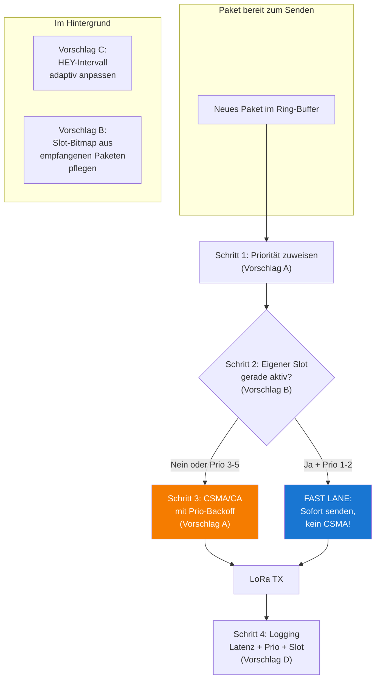

### 8.2 Mixed-Mode Übersicht

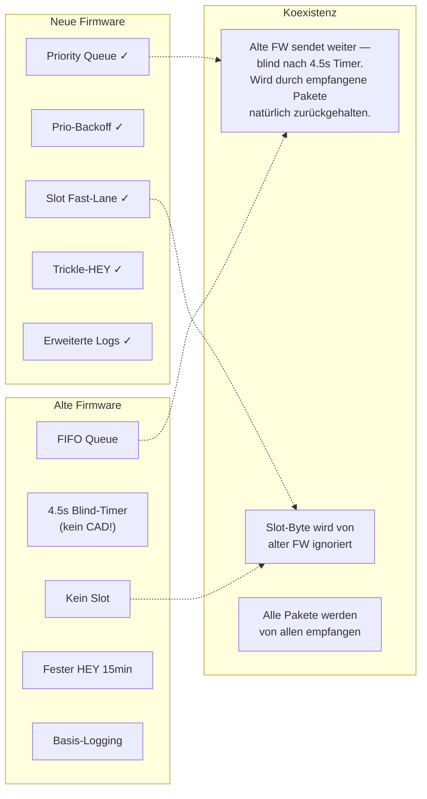

**Kein Node wird ausgesperrt.** Wer updated, profitiert sofort. Wer nicht updated, arbeitet wie bisher. Das ist der natürliche Migrationspfad.

---

## 9. Implementierungsplan

### 9.1 Phasen

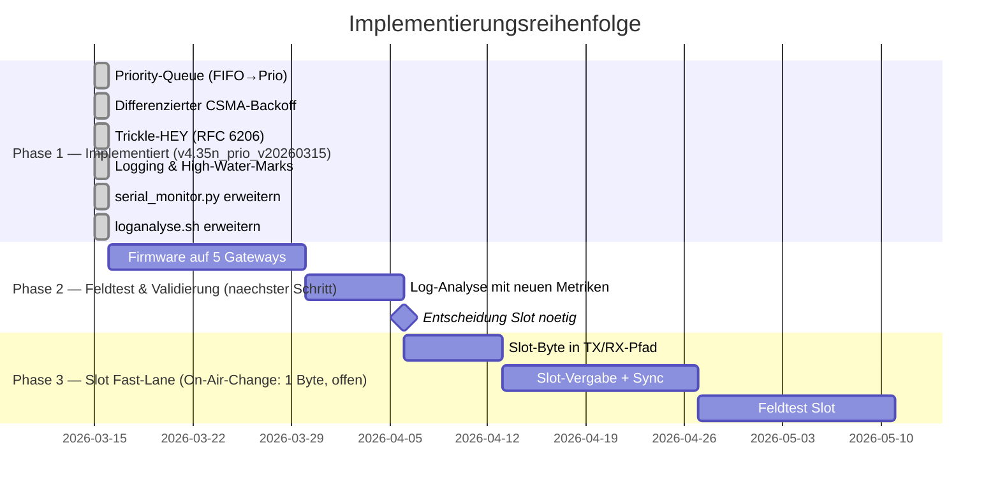

### 9.2 Phasen-Details

| Phase | Beschreibung | Status | On-Air | Risiko |
|-------|-------------|--------|--------|--------|
| **1a** | `ringPriority[MAX_RING]` + Prio-Entnahme via `getNextTxSlot()` | **Implementiert** | Nein | Niedrig |
| **1b** | Prio-abhaengige CSMA-Timeouts (3000–5500ms) | **Implementiert** | Nein | Niedrig |
| **1c** | Prio-Drop bei voller Queue (niedrigste Prio zuerst) | **Implementiert** | Nein | Niedrig |
| **1d** | Trickle-HEY: adaptives Intervall 30s–15min (RFC 6206) | **Implementiert** | Nein | Niedrig |
| **1e** | [MC-STAT], [MC-PRIO], [MC-HWM], [MC-TRICKLE] Logging | **Implementiert** | Nein | Sehr niedrig |
| **1f** | serial_monitor.py + loganalyse.sh Erweiterungen | **Implementiert** | Nein | Keine |
| **2** | Feldtest: Messen ob Prio-Queue + Backoff + Trickle reichen | **Naechster Schritt** | Nein | Keine |
| **3** | Slot-Byte, Superframe, Slot-Vergabe | **Offen** | **Ja (1 Byte)** | Mittel |

**Entscheidungspunkt nach Phase 2:** Zeigen die Logging-Daten, dass Priority-Queue + Backoff + Trickle allein reichen? Dann wird Phase 3 optional oder verschoben. Zeigen sie, dass Prio-1-Pakete immer noch >5s Latenz haben? Dann ist die Slot-Fast-Lane der naechste logische Schritt.

---

## 10. Vergleich mit anderen Projekten

| Feature | MeshCom (geplant) | Meshtastic | IEEE 802.15.4 |
|---------|-------------------|------------|---------------|
| Priority Queue | 5 Stufen, lokal | 7 Stufen, lokal | 4 Klassen (GTS) |
| Prio-Backoff | Nicht-überlappende Bereiche | CW skaliert mit Util% | macMinBE pro Klasse |
| Slot-System | Hybrid: 16 Slots + CSMA | Kein TDMA | GTS (Guaranteed Time Slots) |
| Slot-Werbung | In jedem Paket (1 Byte) | — | Beacon-basiert |
| Adaptive Beacons | Trickle (RFC 6206) | Nein | Nein |
| Kanalzugriff (alt) | Blind-Timer 4.5s, kein CAD | — | — |
| Hidden-Node-Lösung | CAD + Slot + Prio-Backoff | SNR-basiertes Relay | RTS/CTS |

MeshCom wäre damit **das erste LoRa-Mesh-Projekt mit Hybrid-TDMA/CSMA und paketbasierter Slot-Negotiation.** Meshtastic hat Priority-Queue, aber keine Slots. IEEE 802.15.4 hat Slots (GTS), aber keine paketbasierte Werbung.

---

## 11. Offene Fragen

### Geloest durch Phase 1 Implementierung

- ~~**Trickle + Slot-Timeout:** Wenn HEY seltener kommt (Trickle), aber Slot-Info in jedem Paket steckt, ist der Slot-Timeout trotzdem gesichert.~~ **Ja** — Trickle ist implementiert und unabhaengig von Slot-Feature. Slot-Info (Phase 3) wuerde in jedem Paket stecken, nicht nur HEY.

### Offen (relevant fuer Phase 3 — Slot Fast-Lane)

1. **Superframe-Laenge:** 60 Sekunden ok? Kuerzere Frames = schnellere Slot-Nutzung, aber mehr Sync-Overhead.

2. **Slot fuer alle oder nur Repeater/Gateways?** Bei 120 Nachbarn und 16 Slots werden die meisten Nodes slotlos bleiben. Sollen mobile Nodes ueberhaupt Slots beanspruchen?

3. **Slot-Byte Position:** Vor oder nach dem APRS-Header? Vor dem Header ist einfacher zu parsen, aber aendert das Paketformat staerker.

4. **Gateway-Vorrecht:** Sollen Gateways (Internet-Anbindung) einen reservierten Slot-Bereich (z.B. 0-3) haben?

### Offen (Feldtest Phase 2)

5. **Prio-1-Latenz:** Reicht Priority-Queue + Trickle fuer <3s DM-Latenz? Erst nach Feldtest-Daten beantwortbar.

6. **Trickle-Parameter-Tuning:** Ist k=2 (Redundanzschwelle) optimal? Soll Imin hoeher als 30s sein um Burst nach Topologieaenderung zu begrenzen?

---

## 12. Entscheidungsempfehlung

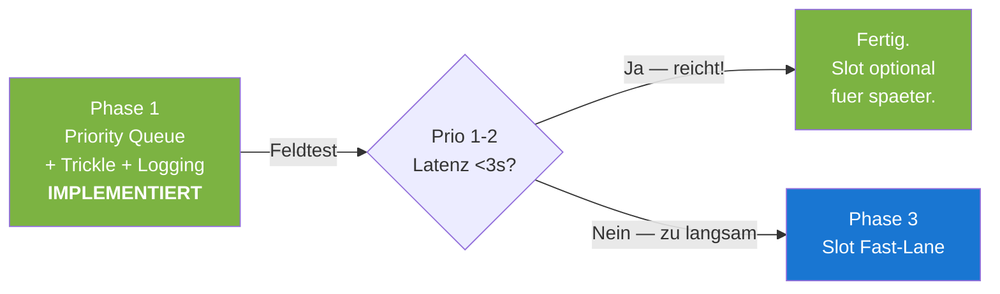

**Status:** Phase 1 ist implementiert (v4.35n_prio_v20260315, Branch `v4.35p_fixes_prio`). Naechster Schritt ist der Feldtest auf 5 Gateways. Die Slot-Fast-Lane wird nur implementiert wenn die Feldtest-Daten zeigen, dass Priority-Queue + Trickle allein nicht ausreichen.

---

## Anhang A: Betroffene Dateien

### Phase 1 — Implementiert (v4.35n_prio_v20260315)

| Datei | Aenderung |
|-------|-----------|
| `src/configuration_global.h` | Prio-Konstanten (MSG_PRIO_*), CSMA-Backoff-Tabelle pro Prio, Trickle-Konstanten |
| `src/lora_functions.h` | Neue Deklarationen: `getMessagePriority()`, `getNextTxSlot()`, `csma_compute_timeout_prio()` |
| `src/lora_functions.cpp` | `getMessagePriority()`, `getNextTxSlot()`, `advanceIReadPastEmpty()`, Prio-Zuweisung in `addTxRingEntry()`, Prio-Entnahme in `doTX()`, Prio-CSMA in `csma_compute_timeout_prio()`, Prio-Drop-Strategie, Latenz-Tracking, Trickle-Konsistenz-Zaehler in `OnRxDone()` |
| `src/loop_functions_extern.h` | `ringPriority[]`, `ringEnqueueTime[]`, Trickle-State, Statistik-Variablen |
| `src/loop_functions.cpp` | Definition aller neuen globalen Variablen |
| `src/esp32/esp32_main.cpp` | Trickle-HEY Timer, [MC-STAT]/[MC-PRIO]/[MC-HWM] Ausgabe (5min/30min) |
| `src/nrf52/nrf52_main.cpp` | Trickle-HEY Timer (gleiche Logik wie ESP32) |
| `tools/serial_monitor.py` | Neue Alerts (PRIO1_STARVED), Prio/Trickle-Summary, RING_DROP_PRIO Zaehler |
| `tools/loganalyse.sh` | Neue Sektionen: PRIORITY_DISTRIBUTION, TRICKLE_HEY, HIGH_WATER_MARKS |

### Phase 3 — Offen (noch nicht implementiert)

| Datei | Geplante Aenderung |
|-------|-----------|
| `src/aprs_functions.cpp` | Slot-Byte encode/decode |
| `src/lora_functions.cpp` | Slot-Byte TX/RX-Pfad, Superframe-Timer |
| `src/mheard_functions.cpp` | Slot-Info aus Nachbar-Paketen tracken |

## Anhang B: Referenzen

- Meshtastic Mesh Broadcast Algorithm: https://meshtastic.org/docs/overview/mesh-algo/
- RFC 6206 — The Trickle Algorithm: https://datatracker.ietf.org/doc/html/rfc6206
- TCP-CSMA/CA (Traffic Class Prioritization): PMC 6386877
- CANL LoRa (Collision Avoidance by Neighbor Listening): HAL hal-04191330
- On-Demand LoRa (Asynchronous TDMA): PMC 6263638
- LMAC: Efficient CSMA for LoRa: ACM 3564530
- MeshCom Loganalyse 2026-03-14: `/Users/martinwerner/Documents/docs-meshcom/MeshCom-LogAnalyse-2026-03-14/`
