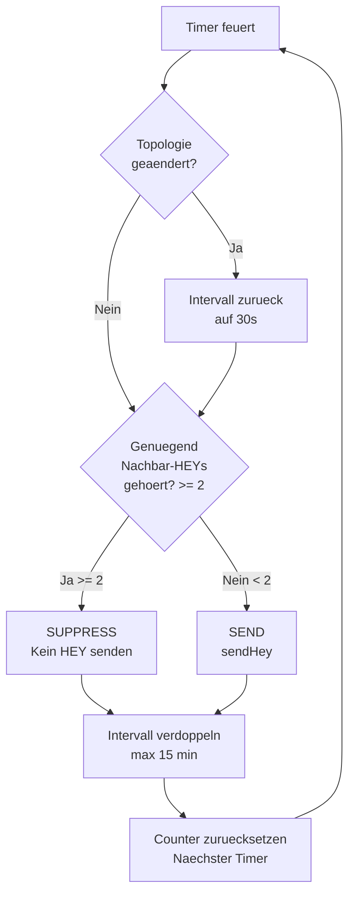
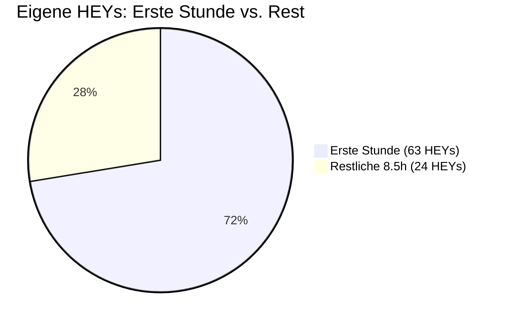
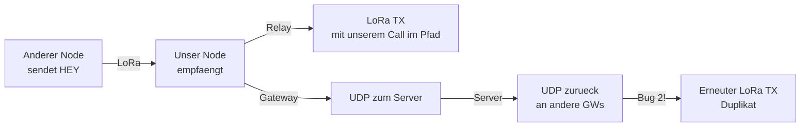

# Trickle-HEY Suppression -- Log-Analyse (2026-03-18, 9.5h)

5 Nodes mit Firmware v4.35p, alle mit WiFi/UDP-Gateway-Funktion.
Logzeitraum: ~21:21 bis ~06:55 (ca. 9.5 Stunden).

---

## 1. Ergebnis auf einen Blick

| Node | Dauer | Ohne Trickle | Mit Trickle | Einsparung | SUPPRESS | Relay-HEY-TX |
|------|-------|-------------|-------------|------------|----------|-------------|
| OE1KBC-12 | 571 min | 38 HEYs | 13 HEYs | **65%** | 34 | 89 |
| OE3MAG-12 | 566 min | 37 HEYs | 26 HEYs | **29%** | 48 | 1353 |
| OE3XIR-12 | 567 min | 37 HEYs | 17 HEYs | **54%** | 43 | 776 |
| OE3XOC-12 | 567 min | 37 HEYs | 22 HEYs | **40%** | 45 | 1390 |
| OE3XWJ-12 | 566 min | 37 HEYs | 9 HEYs | **75%** | 46 | 1322 |

- **"Ohne Trickle"** = Logdauer / 15 Minuten (fixer Upstream-Takt)
- **"Mit Trickle"** = tatsaechlich gesendete eigene HEYs (gezaehlt via `NEW-HEY` im Log)
- **"SUPPRESS"** = Trickle-Timer-Events bei denen der HEY unterdrueckt wurde
- **"Relay-HEY-TX"** = alle HEY-TX (eigene + weitergeleitete von anderen Nodes)

**Durchschnittliche Einsparung: 53%** (gewichtet: 87 statt 186 eigene HEYs).

---

## 2. Wie funktioniert der Trickle-Algorithmus?

**Parameter:**
- Imin = 30s (schnellstes Intervall nach Reset)
- Imax = 15 min (langsamstes Intervall, wie bisheriger fixer Takt)
- k = 2 (Redundanzschwelle: eigenen HEY unterdruecken wenn >= 2 Nachbar-HEYs gehoert)

---

## 3. Zeitlicher Ablauf am Beispiel OE3XIR-12

### Phase 1: Startup-Burst (erste Stunde)

14 von 17 eigenen HEYs werden in der ersten Stunde gesendet.
Das Intervall startet bei 30s und verdoppelt sich nach jedem Timer-Event.
Aber: bei SEND-Events (consistent < 2) verdoppelt sich das Intervall AUCH.

```mermaid
gantt
    title OE3XIR-12: Eigene HEY-Sendungen (erste 80 Minuten)
    dateFormat HH:mm
    axisFormat %H:%M

    section HEY gesendet
    HEY 1 (R11)         :milestone, 21:27, 0min
    HEY 2 (R12)         :milestone, 21:28, 0min
    HEY 3 (R14)         :milestone, 21:29, 0min
    HEY 4 (R15)         :milestone, 21:30, 0min
    HEY 5 (R15)         :milestone, 21:31, 0min
    HEY 6 (R16)         :milestone, 21:33, 0min
    HEY 7 (R17)         :milestone, 21:34, 0min
    HEY 8 (R18)         :milestone, 21:35, 0min
    HEY 9 (R19)         :milestone, 21:38, 0min
    HEY 10 (R20)        :milestone, 21:39, 0min
    HEY 11 (R20)        :milestone, 21:40, 0min
    HEY 12 (R20)        :milestone, 21:42, 0min
    HEY 13 (R21)        :milestone, 21:54, 0min
    HEY 14 (R21)        :milestone, 21:55, 0min

    section SUPPRESS
    SUPPRESS (c=2)       :milestone, 21:26, 0min
    SUPPRESS (c=5)       :milestone, 21:36, 0min
    SUPPRESS (c=5)       :milestone, 21:46, 0min
```

**Beobachtung:** Die R-Zahl (Nachbaranzahl) steigt von 11 auf 21 -- der Node entdeckt laufend neue Nachbarn. Zwischen den SUPPRESS-Events (wo >= 2 konsistente HEYs gehoert wurden) feuert der Timer zusaetzlich mit kuerzeren Intervallen und sendet, weil in diesen kurzen Fenstern noch nicht genuegend Nachbar-HEYs angekommen sind.

### Phase 2: Stabilisierung (nach ~1 Stunde)

```mermaid
gantt
    title OE3XIR-12: HEY-Aktivitaet ueber gesamte Laufzeit
    dateFormat HH:mm
    axisFormat %H:%M

    section Eigene HEYs
    14 HEYs Burst       :active, 21:27, 28min
    HEY 15              :milestone, 22:39, 0min
    HEY 16              :milestone, 22:40, 0min
    HEY 17              :milestone, 05:09, 0min

    section SUPPRESS bei Imax
    Regelmaessig alle 15min :done, 23:09, 480min
```

Ab 22:40 nur noch **1 HEY in 6.5 Stunden** (um 05:09, vermutlich nach kurzem Reset).

---

## 4. Was passiert bei stabilem Netz bei Imax (15 min)?

Auszug aus dem SUPPRESS-Log von OE3XIR-12 im Steady State:

| Zeit | Entscheidung | Gehoerte Nachbar-HEYs | Intervall |
|------|-------------|----------------------|-----------|
| 23:09 | SUPPRESS | 31 | 15 min |
| 23:24 | SUPPRESS | 22 | 15 min |
| 23:39 | SUPPRESS | 30 | 15 min |
| 23:54 | SUPPRESS | 28 | 15 min |
| 00:09 | SUPPRESS | 17 | 15 min |
| 00:24 | SUPPRESS | 17 | 15 min |
| 00:39 | SUPPRESS | 23 | 15 min |
| 00:54 | SUPPRESS | 31 | 15 min |
| 01:09 | SUPPRESS | 27 | 15 min |
| ... | SUPPRESS | 12-35 | 15 min |

In jedem 15-Minuten-Fenster hoert OE3XIR-12 zwischen **12 und 35 HEYs** von Nachbarn.
Das ist weit ueber der Schwelle k=2. Daher wird der eigene HEY zuverlaessig unterdrueckt.

**Wichtig:** Der Node bleibt trotzdem sichtbar fuer andere, weil:
1. Er Position-Pakete sendet (eigener Positionstimer, unabhaengig von Trickle)
2. Er Text-Nachrichten relayed (mit seinem Callsign im Pfad)
3. Er ACKs sendet

---

## 5. Vergleich: Phasen-Verteilung aller Nodes

| Node | Erste Stunde | Restliche ~8.5h | Effektives Intervall (Rest) |
|------|-------------|----------------|---------------------------|
| OE1KBC-12 | 10 | 3 | 1x alle ~170 min |
| OE3MAG-12 | 17 | 9 | 1x alle ~57 min |
| OE3XWJ-12 | 6 | 3 | 1x alle ~170 min |
| OE3XIR-12 | 14 | 3 | 1x alle ~170 min |
| OE3XOC-12 | 16 | 6 | 1x alle ~85 min |

OE3MAG-12 sendet die meisten HEYs — vermutlich haeufigere Topologie-Aenderungen
(mehr direkte RF-Nachbarn mit wechselnder Erreichbarkeit).

---

## 6. Wo kommen die restlichen HEY-TX her?

Die grosse Zahl an HEY-TX pro Node (776-1390) sind **nicht eigene HEYs**, sondern
weitergeleitete HEYs von anderen Nodes im Mesh:

| Node | Eigene HEYs | Relay-HEY-TX | Verhaeltnis |
|------|------------|-------------|-------------|
| OE1KBC-12 | 13 | 89 | 1:7 |
| OE3MAG-12 | 26 | 1353 | 1:52 |
| OE3XIR-12 | 17 | 776 | 1:46 |
| OE3XOC-12 | 22 | 1390 | 1:63 |
| OE3XWJ-12 | 9 | 1322 | 1:147 |

Die hohen Relay-HEY-TX Zahlen (1:50 bis 1:147) zeigen den **UDP-Dedup-Bug (Bug 2)**:
Dieselben HEYs kommen ueber den Server zurueck und werden erneut gesendet.
Nach dem Bugfix sollte das Verhaeltnis deutlich sinken.

---

## 7. Fazit

### Was Trickle tatsaechlich bringt

1. **Steady State (Imax):** Im stabilen Netz mit vielen Nachbarn werden eigene HEYs
   fast komplett unterdrueckt. Bei 12-35 gehoerten Nachbar-HEYs pro 15-Min-Fenster
   ist die Schwelle k=2 immer erfuellt.

2. **Startup/Discovery:** In der ersten Stunde sendet der Node 6-17 HEYs (Nachbar-Entdeckung,
   Intervall-Ramp-up). Das ist unvermeidbar und gewuenscht -- neue Nodes muessen sich
   im Netz bekannt machen.

3. **Gelegentliche Resets:** Durch Topologie-Aenderungen oder Intervall-Resets kommen
   vereinzelt HEYs auch im Steady State. Das ist Designabsicht -- ein Node soll nicht
   komplett verstummen.

### Einsparung in Zahlen

- **Eigene HEYs:** 53% weniger als ohne Trickle (87 statt 186 ueber 9.5h, alle 5 Nodes)
- **Steady-State-Einsparung:** >90% (3 HEYs in 8.5h statt 34 ohne Trickle, Beispiel OE3XIR)
- **Nicht eingespart:** Relay-HEY-TX (776-1390 pro Node) -- das sind fremde HEYs die
  weitergeleitet werden. Hier hilft nur der UDP-Dedup-Bugfix.

### Offene Fragen

- Die `[MC-TRICKLE] SEND`-Logzeilen fehlen im Output (0 bei allen 5 Nodes), obwohl
  HEYs gesendet werden. Vermutlich Serial-Buffer-Overflow waehrend der geschaeftigen
  Startup-Phase. Fuer kuenftige Versionen sollte die SEND-Logzeile VOR dem `sendHey()`
  Aufruf stehen (statt danach), damit sie nicht vom HEY-Output verdraengt wird.

- `Info: bereits in der aktuellen Github-Version inkludiert` (KBC)

## 8. Nutzen der HEY Meldungen und damit verbunden das sammeln der Node-PATH (KBC)

### DM-Meldungen und ACK-Meldungen
- die gesammeleten Node-Path Informationen wreden dazu benutzt werden um den Destination-Path nicht nur mit dem Destiantion-Call zu befüllen sondern mit dem bekannten Path
- Jeder Node entscheidet anhand vom Path ob das Node-Call im Destination-Path vorkommt ob MESH gemacht wird.
- **MESH** wird nur für eine Meldung mit nicht vorhandenem Node-Call im Destination-Path temporär **nicht** angewendet
- **MESH** wird aber auch angewendet (auch wenn nicht permanent gesetzt) bei vorhandenem Node-Call im Destination-Path. Damit kann auch ein gesteuertes **Routing** aufgebaut werden (per Hand oder per Automatik).

### GM-Meldungen
- Für gesteurtes Routing ebefalls verwenden

### ALL-Meldungen
- keine Verwendung

### Umsetzung
- Auch beim Absenden innerhalb der HW-Wolke kann der Path verwendet werden wenn in der Path-Tabelle das gewünschte Destination-Call (egal an welcher Stelle) vorkommt. Path wird dann evtl. gekürzt angewendet.

### Code-Aufwand
- ist nur in der Routine lora_functions.cpp zu erledigen bzw. loop_functions.cpp (sendtext)

